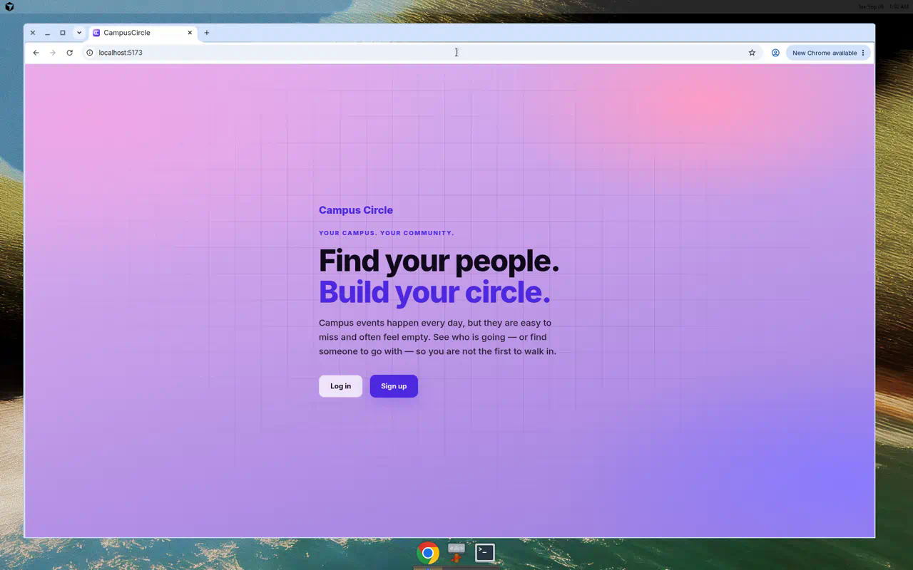
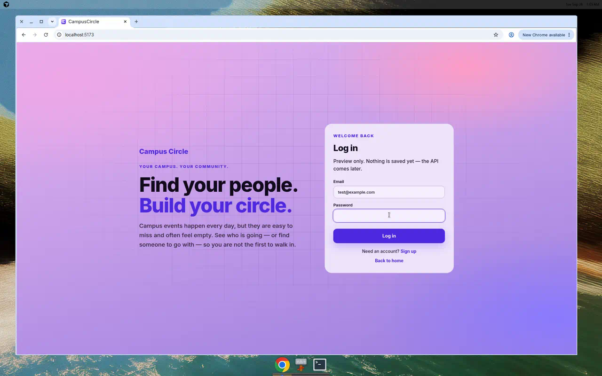
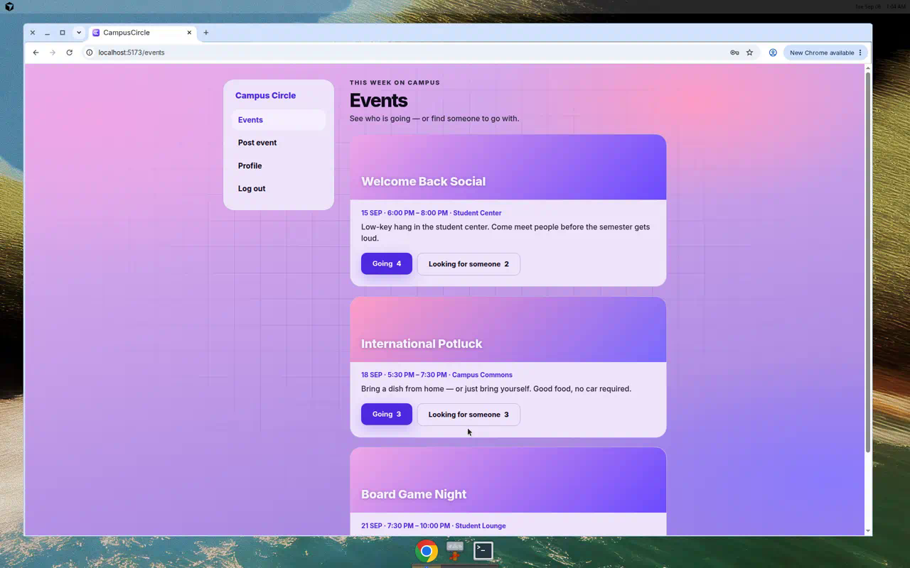
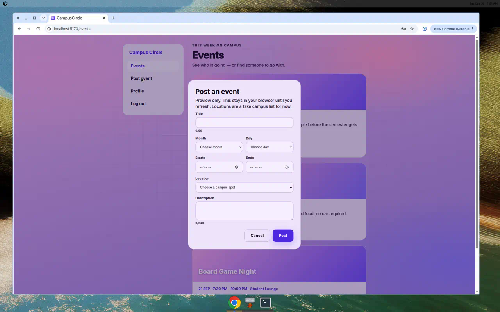
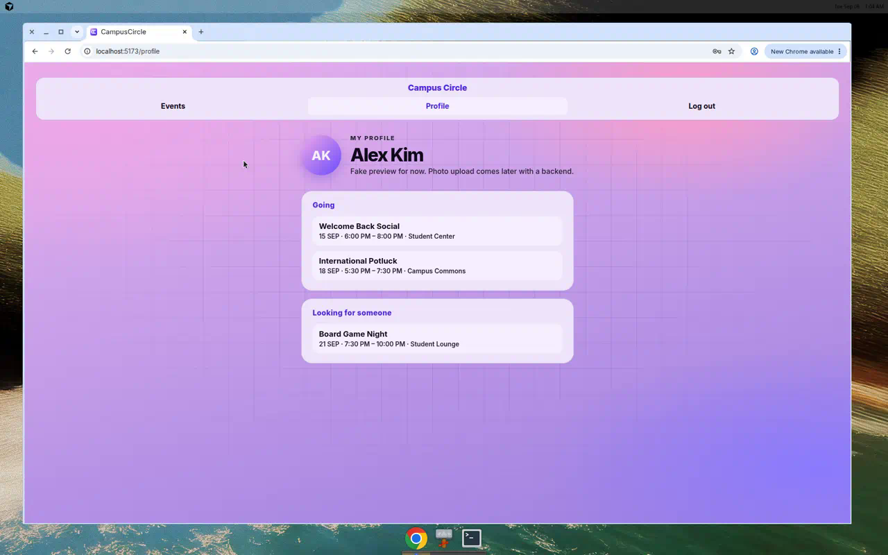

# CampusCircle

CampusCircle helps students find campus events and see who else is going, so showing up feels less awkward.

Campus events already exist, but they are often only posted on university social accounts. Rooms look empty, and a lot of people — especially students without a car, or who are not into nightlife — do not want to be the first to walk in. CampusCircle puts those events in one place. You can mark **Going** or **Looking for someone** so others can reach out and go together.

## Status

| Area | Status |
| --- | --- |
| Welcome, login, and signup screens | Done (mock auth — any credentials work) |
| Events feed, post-event form, RSVP UI | Done (events load/save via API) |
| Profile page | Done (mock data) |
| FastAPI hello + health routes | Done |
| PostgreSQL connection via `.env` | Done |
| Create event API (`POST /events`) | Done |
| List events API (`GET /events`) | Done |
| Wire frontend events to API | Done |
| Save RSVP changes | Done |
| Profile from RSVPs | Next |
| Real login / auth | Later |

**Frontend** Events page loads from `GET /events` and posts with `POST /events`. Clicking **Going** / **Looking for someone** saves an RSVP for the demo user Alex Kim. Refresh keeps events and RSVPs. The profile page is still mock. Auth is still mock.

## Screenshots

### Welcome


### Login


### Events feed


### Post an event


### Profile


## What’s working today

- Browse campus events from the API (PostgreSQL), not mock feed data
- RSVP: **Going** and **Looking for someone** (click saves for demo user Alex Kim; hover shows names)
- Post-event form saves through the API (survives refresh)
- Profile page with avatar placeholder and event lists (mock)
- Logout confirmation dialog
- Backend `GET /` and `GET /health` (health also checks the database)
- Backend `POST /events` / `GET /events` / `POST /events/{id}/rsvp`
- CORS enabled so the React app (port 5174) can call the API (port 8000)

Not yet: profile built from RSVPs, real accounts, photo upload, clubs, chat, maps, or admin tools.

## Tech stack

- **Frontend:** React + TypeScript (Vite)
- **Backend:** FastAPI
- **Database:** PostgreSQL (`events`, `users`, and `rsvps` tables created on API startup)

## Run the frontend

```bash
cd frontend
npm install
npm run dev
```

Open [http://localhost:5174](http://localhost:5174). Log in with any email and password (credentials are not checked yet).

Keep the backend running on port 8000 at the same time, or the Events page cannot load/save.

## Run the backend

See [backend/README.md](backend/README.md) for PostgreSQL setup and `.env`.

```bash
cd backend
python3 -m venv .venv
source .venv/bin/activate
pip install -r requirements.txt
cp .env.example .env   # once
uvicorn app.main:app --reload
```

- http://localhost:8000/ — hello JSON
- http://localhost:8000/health — should show `"database": "ok"`
- http://localhost:8000/docs — interactive API docs

## Repository layout

This repo is a **monorepo**: the React app and the FastAPI app live side by side.

```
campus-circle/
├── docs/screenshots/         # README screenshots
├── frontend/                 # React + TypeScript (Vite)
│   └── src/
│       ├── api/              # backend calls (`events.ts`)
│       ├── components/       # reusable UI
│       ├── data/             # mock events and profile data
│       ├── pages/            # Welcome, Events, Profile
│       └── types/            # TypeScript shapes (Event, User, …)
└── backend/                  # FastAPI + PostgreSQL
    ├── .env.example
    ├── requirements.txt
    └── app/
        ├── main.py           # FastAPI app
        ├── database.py       # Postgres connection
        ├── routers/          # HTTP URLs (`events.py`)
        ├── models/           # PostgreSQL tables (`event.py`)
        └── schemas/          # JSON in/out (`event.py`)
```

Read [STRUCTURE.md](STRUCTURE.md) for why each folder exists.
